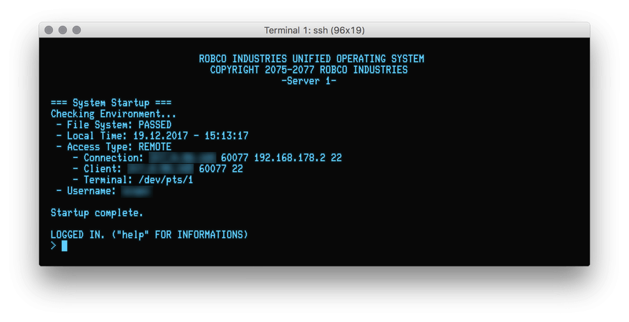

# Simple Network Shell

This is just an minimalistic (and nerdy) shell to use for example as sleep mode appilcation or launcher if you don't want to give an user a full bash on remote login.

Although it is useable, snshell is a quite old project (coded in 2013) and meant to be a example how to simulate UOS. I just put the functionality of Sleep Dummy Shell in it for an other project ;)

* nerdy - the shell mimics the look of Fallout RobCo Industries UOS Shell
* sleep mode - pings every 10 seconds to help to get the connection to stay alive. Usefull for tunneling and unstable connections.
* application launcher - external programs can be defined with INI-files

Based on:

* Sleep Dummy Shell (SleepShell) - http://www.mariovaldez.net/software/sleepshell/ 
* RobCo Industries Unified Operating System (Fallout universe)

Uses:

* inih -- simple .INI file parser - http://code.google.com/p/inih/

Hints:

* To get the RobCo header on login (like showed above) just look at snshell_ui.c lines 11-19
* Add the programs you want to offer as ini (without .ini suffix) to /opt/snshell/snshell_data/applications
* You must "sudo make install" it to get it to work.

*(The picture shows snshell running on my home server connected through [Cathode](http://www.secretgeometry.com/apps/cathode/)/SSH)*
